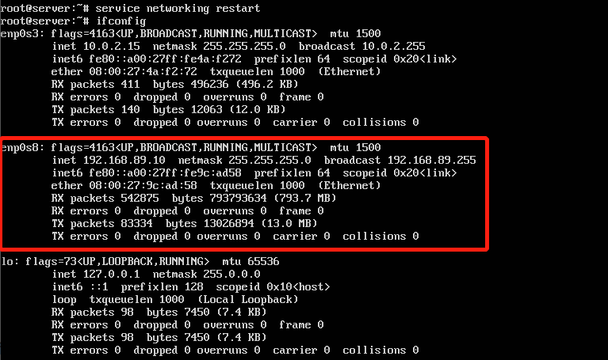
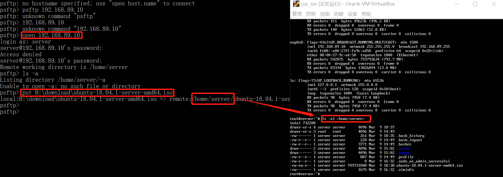
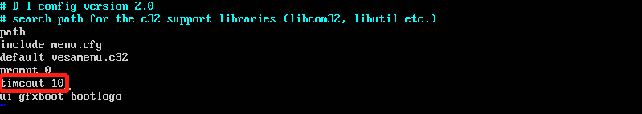
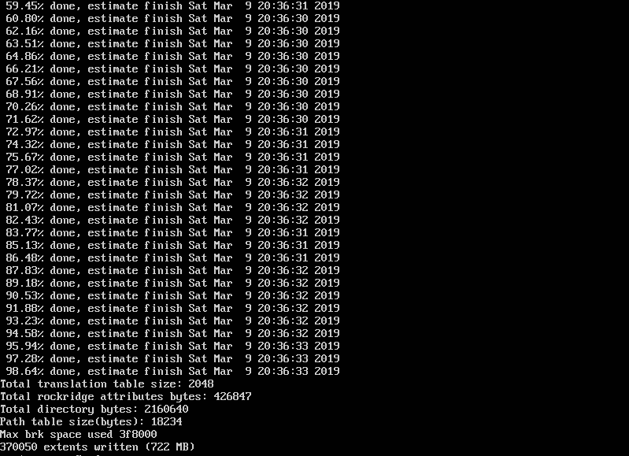
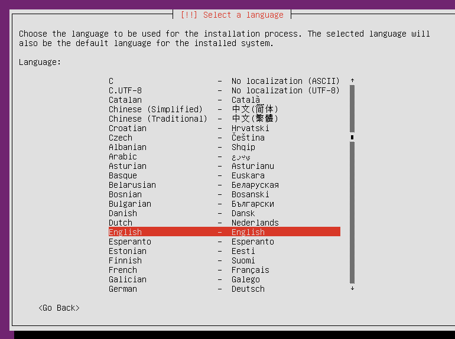
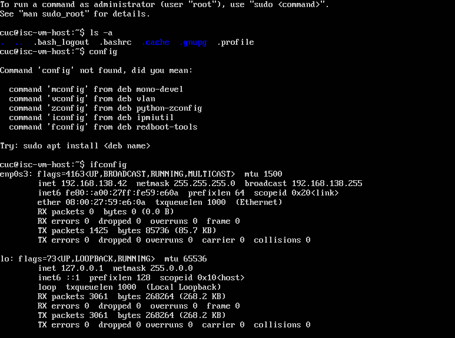
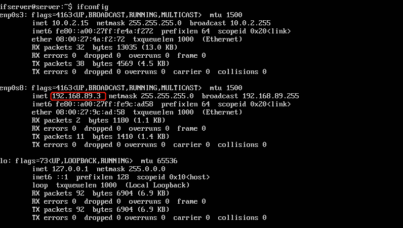
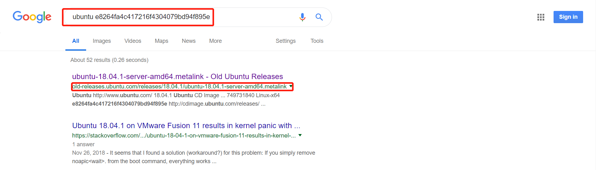

## 无人值守Linux安装镜像制作

### 实验问题

- 如何配置无人值守安装 `iso` 并在 `Virtualbox`  中完成自动化安装。
- `Virtualbox` 安装完 `Ubuntu` 之后新添加的网卡如何实现系统开机自动启用和自动获取IP？
- 如何使用 `sftp` 在虚拟机和宿主机之间传输文件？

- 用什么「工具」能提高「差异」比对的效率？
- 修改的作用是什么？


### 实现特性

- 定制一个普通用户名和默认密码
- 定制安装 OpenSSH Server
- 安装过程禁止自动联网更新软件包


### 实验环境

- OS : ubuntu 18.04 TLS  Server
- Net : host only => 192.168.89.10/24，NAT => 10.0.2.5/24


### 实验操作

#### 配置网络

直接使用 `vim` 编辑 `\etc\network\interfaces` :

```bash
# 切换 root 权限
su -

vi \etc\network\interfaces

# 插入以下网卡配置信息
auto enp0s8
iface enp0s8 inet static
	address 192.168.89.10
	netmask 255.255.255.0
	broadcast 192.168.89.255
	
# 重启网络
service networking restart
```

`ifconfig `查看结果：




#### 传输镜像

由于需要回答问题 `如何使用 sftp 在虚拟机和宿主机之间传输文件？`，这里使用 `putty` 自带的 `psftp` 进行镜像传输。

虚拟机安装 SSH，打开服务：

```bash
apt install ssh
service ssh start
```

宿主机 ( Windows ) 打开 `psftp.exe` ，输入以下指令:

```bash
open 192.168.89.10
put your file path
```

可以直接将文件拖拽避免输入路径。



上图显示镜像已成功传输。


#### 拷贝文件

直接参照课件：

```
# 创建一个工作目录用于克隆光盘内容
mkdir cd
 
# 同步光盘内容到目标工作目录
# 一定要注意loopdir后的这个/，cd后面不能有/
rsync -av loopdir/ cd

# 卸载iso镜像
umount loopdir

# 删除loopdir
rm loopdir
```


#### 更改配置 完成定制

```
# 下载 seed 文件
apt install wget
wget http://sec.cuc.edu.cn/huangwei/course/LinuxSysAdmin/exp/chap0x01/cd-rom/preseed/ubuntu-server-autoinstall.seed -O ~/cd/preseed/ubuntu-server-autoinstall.seed 


# 编辑Ubuntu安装引导界面增加一个新菜单项入口
vim isolinux/txt.cgi


# 添加以下内容到该文件后强制保存退出
label autoinstall
  menu label ^Auto Install Ubuntu Server
  kernel /install/vmlinuz
  append  file=/cdrom/preseed/ubuntu-server-autoinstall.seed debian-installer/locale=en_US console-setup/layoutcode=us keyboard-configuration/layoutcode=us console-setup/ask_detect=false localechooser/translation/warn-light=true localechooser/translation/warn-severe=true initrd=/install/initrd.gz root=/dev/ram rw quiet


# 设置超时时间 10 <=> 1 s
vim isolinux/isolinux.cfg
[+] timeout 10
```



```
# 重新生成md5sum.txt
cd ~/cd && find . -type f -print0 | xargs -0 md5sum > md5sum.txt


# 安装 mkisofs
apt install mkisofs

# 完成定制
mkisofs -r -V "Custom Ubuntu Install CD" \
            -cache-inodes \
            -J -l -b isolinux/isolinux.bin \
            -c isolinux/boot.cat -no-emul-boot \
            -boot-load-size 4 -boot-info-table \
            -o  /home/server/custom.iso ~/cd/s
```




#### 反传镜像

直接使用 `psftp` 得到镜像：

```
open 192.168.89.10
get custom.iso
```


#### 测试结果

加载镜像，镜像停止在以下位置：



手动选择 `language` 和 `location` 之后，剩下的选项才能自动加载。（未解决）之后自动安装完成，成功登录。



详细的录屏文件 ( 注意本机比机房的机器还要卡，视频大概有 17 min，重点是我手动 `enter`了 `language` 和 其后面的一个选项，当我选择完选项之后正常安装)：


### 回答问题

回答上面的问题 (2)，(4)，(5)

- `Virtualbox` 安装完 `Ubuntu` 之后新添加的网卡如何实现系统开机自动启用和自动获取IP？

  之前是在使用静态IP，直接把之前的配置文件修改即可：

  ```bash
  # 切换 root 权限
  su -
  
  vi \etc\network\interfaces
  
  # 插入以下网卡配置信息
  auto enp0s8
  iface enp0s8 inet dhcp
  
  # 重启主机，检查网卡是否自动启用和获取IP
  reboot
  ```

  结果如下( 之前的地址是 192.168.89.10 ):

  

- 用什么「工具」能提高「差异」比对的效率？

  只能想到 `git diff` 和 网上的一些在线文本比对工具。

- 修改的作用是什么？

  - `[+] d-i localechooser/supported-locales multiselect en_US.UTF-8, zh_CN.UTF-8`  进行本地环境配置
  - `[+] d-i pkgsel/install-language-support boolean false`  跳过语言支持
  - `d-i console-keymaps-at/keymap select us` => `d-i console-setup/ask_detect boolean false`  跳过键盘自检询问
  - `[+] d-i netcfg/link_wait_timeout string 5` 修改链接超时时间
  - `[+] d-i netcfg/dhcp_timeout string 5` 修改 DHCP 超时时间
  - `[+] d-i netcfg/disable_autoconfig boolean true` 启动手工配置网络
  - `d-i mirror/http/hostname string http.us.debian.org`=> `d-i mirror/http/hostname string archive.ubuntu.com`
  - `d-i mirror/http/directory string /debian`=>`d-i mirror/http/directory string /ubuntu`
  - `[+] d-i netcfg/hostname string isc-vm-host` 更改主机名
  - `[+] d-i passwd/user-fullname string cuc` 设置用户全名
  - `[+] d-i passwd/username string cuc` 设置用户名
  - `[+] d-i passwd/user-password password sec.cuc.edu.cn` 设置密码
  - `[+] d-i passwd/user-password-again password sec.cuc.edu.cn`  设置再次输入没密码
  - `[+] d-i user-setup/encrypt-home boolean false`
  - `d-i time/zone string US/Eastern` => `d-i time/zone string Asia/Shanghai` 更改时区
  - `d-i clock-setup/ntp boolean true` => `d-i clock-setup/ntp boolean false`安装时不使用 NTP 设置闹钟
  - `[+] d-i partman-auto/init_automatically_partition select biggest_free` 选择最大空闲分区 
  - `[+] d-i partman-lvm/confirm_nooverwrite boolean true` 使用 LVM 进行磁盘分区
  - `[+] d-i partman-auto-lvm/guided_size string max` 逻辑卷最大
  - `d-i partman-auto/choose_recipe select atomic` => `d-i partman-auto/choose_recipe select multi`
  - `[+] d-i apt-setup/use_mirror boolean false` 禁用网络镜像
  - `[+] tasksel tasksel/first multiselect server` 选择安装 `server` 安装包
  - `[+] d-i pkgsel/include string openssh-server` 安装 `openssh-server`
  - `[+] d-i pkgsel/upgrade select none` 禁止自动更新
  - `[+] d-i pkgsel/update-policy select unattended-upgrades` 升级策略选择自动更新


### 排错

主要尝试解决必须手动选择 `language` 和 `location` 的问题。

尝试列举出以下可能出错的环节：

- `wget`下载的镜像文件出错。
- 宿主机使用 `psftp` 向 `ubuntu`传输镜像文件时出错。
- `isolinux/txt.cfg` 编辑出错。
- `preseed` 文件出错。
- `mkisofs` 重新制作镜像出错。
- `ubuntu` 使用 `psftp` 向宿主机反传镜像文件时出错。
- 虚拟机自身出现问题。

列举并实施解决方案：

- `wget`下载的镜像文件出错。

  - 解决方案：计算 `iso` 文件的 `md5` 值

  - 具体操作：在`windows`命令行中输入以下指令:

    ```
    # 输入
    certutil -hashfile your\path\ubuntu-18.04.1-server-amd64.iso MD5
    
    # 输出
    MD5 的 H:\download\ubuntu-18.04.1-server-amd64.iso 哈希:
    e8264fa4c417216f4304079bd94f895e
    CertUtil: -hashfile 命令成功完成。
    ```

    直接在搜索引擎中搜索，排除镜像源的问题 ↓

    

- 宿主机使用 `psftp` 向 `ubuntu`传输镜像文件时出错。

  - 这里并考虑 `psftp` 传输出错的可能性较小，没有进行测试。
- `isolinux/txt.cfg` 编辑出错。

  - 解决方案：重新使用 `putty` 连接，直接将课件上的内容复制粘贴到 `txt.cfg` 的第一行，且尝试了多次。且在 `menu` 成功显示了新增的 `option`。 
- `preseed` 文件出错。

  - 解决方案：直接使用 `wget` 下载课件上的 `ubuntu-server-autoinstall.seed` ，并且经过多次比对。

- `mkisofs` 重新制作镜像出错。

  - 解决方案：直接复制课件上的指令，修改 `image` 和 `build` 的路径。使用指令时没有报错。

- `ubuntu` 使用 `psftp` 向宿主机反传镜像文件时出错。( 同 2 )

- 虚拟机自身出现问题。

  - 解决方案：使用 U 盘将定制的 `custom.iso` 拷贝到机房的电脑上，使用 `virtual box` 挂载镜像，出现相同的问题。

      

### 其他解决方案

这里的解决方案主要针对 `language` 和 `location` :

- 增加 `isolinux/lang` 文件 ( 主要针对 `ubuntu 14.04` )

  - 输入以下指令:

    ```bash
    # 向 lang 写入需要的语言
    echo "en" > isolinux/lang
    echo "zh_CN" >> isolinux/lang
    ```

  - 测试无效。

- 修改 `isolinux/langlist` 中的选项，将不需要的语言全部删除，只保留 `zh_CN` 和 `en`。

  - 测试无效。

- 修改 `preseed` 中 `localechooser/supported-locales` 变量值 `zh_CN` => `nl_NL`。

  - 测试无效。

还尝试了一些不太靠谱的解决方案，最终还是没有解决。


### 参阅

- [How To Use SFTP to Securely Transfer Files with a Remote Server](https://www.digitalocean.com/community/tutorials/how-to-use-sftp-to-securely-transfer-files-with-a-remote-server)
- [CHAPTER 6: USING PSFTP TO TRANSFER FILES SECURELY](https://www.ssh.com/ssh/putty/putty-manuals/0.68/Chapter6.html)

- [Exp for Chapter-1](https://github.com/CUCCS/linux/blob/master/2017-1/tzw/chapter1/chapter1.md)

- [Ubuntu Preseed Question](https://www.reddit.com/r/linuxadmin/comments/7ut4bh/ubuntu_preseed_question/)
- [Prevent Language selection at ubuntu installation](https://unix.stackexchange.com/questions/196874/prevent-language-selection-at-ubuntu-installation)

- [How do I create a completely unattended install of Ubuntu?](https://askubuntu.com/questions/122505/how-do-i-create-a-completely-unattended-install-of-ubuntu/122506#122506)

- [example-preseed.txt](https://help.ubuntu.com/lts/installation-guide/example-preseed.txt)

- [Appendix B. Automating the installation using preseeding](https://help.ubuntu.com/lts/installation-guide/s390x/apb.html)
