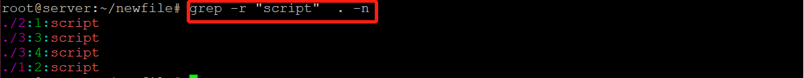

## From GUI to CLI

### 实验要求

- 确保本地已经完成 `asciinema auth`，并在 `asciinema` 成功关联了本地账号和在线账号

- 上传本人亲自动手完成的 `vimtutor` 操作全程录像

- 在自己的 `github` 仓库上新建 `markdown` 格式纯文本文件附上 `asciinema` 的分享URL

- **提醒** 避免在终端操作录像过程中暴漏**密码、个人隐私**等任何机密数据


### VIMTUTOR实验录频

```bash
# 安装 asciimena
apt-get install asciimena

# 完成认证
asciinema auth

# 录制视频
asciinema rec -t "my vimtutor"

# 退出录制
CTRL + D

# 上传视频
[Enter]
```

完成视频录制，并且上传视频完成之后，分享链接：

[](https://asciinema.org/a/RTGNNSegRzEMEoEbSnxEhcSNA)


### VIMTUTOR 完成后的自查清单

`Ctrl - xxx` 表示按住 `Ctrl`  后 按 `xxx`

- 你了解vim有哪几种工作模式？
  - INSERT
  
  - VISUAL
  
  - COMMAND
  
  - NORMAL
  
- Normal模式下，从当前行开始，一次向下移动光标10行的操作方法？如何快速移动到文件开始行和结束行？如何快速跳转到文件中的第N行？

  - 下移10行：`10j`
  
  - 移到文件开始行：`gg`
  
  - 移动文件结束行：`G`
  
  - 快速移动跳转到文件第N行：`NG`、`:N`

- Normal模式下，如何删除单个字符、单个单词、从当前光标位置一直删除到行尾、单行、当前行开始向下数N行？

  - 删除单字符：选中要删除的单字符，`x`
  
  - 删除单个单词：`dw` 、`de` ，已知单词长度 `N`，可以使用 `Nx`
  
  - 从当前光标位置一直删除到行尾：`d$` 、`v$x`
  
  - 删除单行：`dd`
  
  - 删除当前行向下 N 行：`dNd`
  
- 如何在vim中快速插入N个空行？如何在vim中快速输入80个-？
  
  - 快插 N 个空行：`No + Esc`
  
  - 快插 80 个 -：`80i- + Esc`
  
- 如何撤销最近一次编辑操作？如何重做最近一次被撤销的操作？
  
  - 撤销最近一次编辑：`u`
  
  - 重做上一次被撤销的操作：`Ctrl - R`
  
- vim中如何实现剪切粘贴单个字符？单个单词？单行？如何实现相似的复制粘贴操作呢？

  - 剪切粘贴：`x`、`dw`、`dd` 剪切，使用 `p` 粘贴
  
  - 复制粘贴：`v` 进入 `VISUAL`，`l 或 h`、`w`、`$` 选中内容，`d`删除内容 

- 为了编辑一段文本你能想到哪几种操作方式（按键序列）？

  - 进入 `INSERT` 模式
    - `i` 切换到插入模式，在当前光标位置之前插入。
    - `I` 光标移动到当前行的开头进入插入模式。
    - `a` 在光标之后进入插入模式
    - `A` 行尾进入插入模式
    - `R` 进入插入模式替换当然文档的字符
    - `o` 当前行的下方打开新行
    - `O` 当前行的上方打开新行
  - `v` 进入 `VISUAL`  模式，直接操作。
- 查看当前正在编辑的文件名的方法？查看当前光标所在行的行号的方法？
  - `Ctrl - G`
- 在文件中进行关键词搜索你会哪些方法？如何设置忽略大小写的情况下进行匹配搜索？如何将匹配的搜索结果进行高亮显示？如何对匹配到的关键词进行批量替换？
  - 前向搜索：`/key`
  - 后向搜索：`?key`
  - 忽略大小写显示：`:set ic`
  - 高亮显示：`:set hls is`
  - 全局替换匹配关键字：`:%s/old/new/g`
- 在文件中最近编辑过的位置来回快速跳转的方法？
  - 前向：`Ctrl - O`
  
  - 后向：`Ctrl - I`
  
- 如何把光标定位到各种括号的匹配项？例如：找到(, [, or {对应匹配的),], or }
  - 需要匹配处 : `%`
  
- 在不退出vim的情况下执行一个外部程序的方法？
  - `:! 外部程序`
  
- 如何使用vim的内置帮助系统来查询一个内置默认快捷键的使用方法？如何在两个不同的分屏窗口中移动光标？
  - 查看帮助：`:help`

  - 在两个分屏窗口移动光标：`Ctrl - w`


### 一些文本处理的任务

- 查找并统计某函数在整个“项目”中被调用次数，并输出在哪些文件、具体那些行中调用到了该函数

- 在整个目录中查找某关键词出现在哪些文件的哪些行
  - 查找某关键词在指定文件中的哪些行：`sed -n '/key/ =' file`

  - 在整个目录中查找某关键词出现在哪些文件的哪些行: `grep -r -n key path`

    
- 删除C语言编写项目中的所有注释行
  - C 语言注释行格式：`//`、`/* */`

  - 测试文件：

    ```c
    // 上面为空行
    // 单行注释
    int a = 1; // 后注释
    
    int b = 2; /* 后注释 */
    
    /* 前注释 */int c = 3;
    /*单行注释*/
    
    /*前后注释*/int d = 4;/*前后注释*/int e = 5;/*前后注释*/
    
    /*两边包围的注释*/
    int f = 6;
    /*两边包围的注释*/
    
    int /*神经病注释*/g /*神经病注释*/ = 7;
    
    char* h = "[+]/*字符串里*/[+]";
    char* i = "[+]//字符串里";
    
    /*
    多行注释
    */
    ```

  - `sed` 测试脚本

    ```bash
    sed '
      /".*\/\*.*\*\/.*"/b skip				# 跳过字符串/**/
      s|\/\*|\n\/\*\n|g	  				# /* 前后增加 \n
      s|\*\/|\n\*\/\n|g	  				# */ 前后增加 \n
      :skip' org					

    sed '
      /".*\/\*.*\*\/.*"/b skip				# 跳过字符串 /**/
      /".*\/\/.*"/b skip    				# 跳过字符串 //
      s|\/\/.*||g        					# // 注释替换为空
      /\/\*/,/\*\//d      					# start:/* end:*/ 删除
      /^\s*$/d        					# 删除空行
      :skip'
    ```

    上面主要是来自 （[来源]( <https://blog.thoxvi.com/2018/04/01/%E8%AE%BA%E5%A6%82%E4%BD%95%E7%94%A8sed%E9%AA%9A%E6%B0%94%E5%9C%B0%E5%8E%BB%E9%99%A4C%E6%B3%A8%E9%87%8A/>)）, 下面是自己的：

    ```bash
    sed '
      /".*\/\*.*\*\/.*"/b skip				# 跳过字符串/**/
      s|\/\*|\n\/\*\n|g	  				# /* 前后增加 \n
      s|\*\/|\n\*\/\n|g	  				# */ 前后增加 \n
      :skip' org					
    
    sed '
 	  /".*\/\*.*\*\/.*"/b skip		  		# 跳过字符串 /**/
 	  /".*\/\/.*"/b skip    				# 跳过字符串 //
  	  s|\/\/.*||g       					 # // 注释替换为空
  	  /\/\*/ {
        /\*\// {
            b next    					 # 本行匹配直接跳转替换
        };			
        :loop;
        /\*\//! {
            N;
            b loop     					 # 读取下一行继续循环
        };
        :next;
        /\*\// {
            s/\/\*.*\*\///g				  # 替换
        }
	}
    ```

    测试报错（未解决）。


### 提问的智慧 - 描述你的环境

自己回答以下问题（软件相关）

- 操作系统发行版和内核信息
  - `lsb_release -a`
  - `uname -a`
- 系统中当前有谁在线
  - `w`
- 现在在运行的进程有哪些
  - `ps aux`
  - `top`
  - 根据 `/proc/` 目录下 `pid`，`/proc/pid/status` 查看进程状态
- 哪些进程在监听哪些端口
  - `ps aux`
  - `top`
  - 根据 `/proc/` 目录下 `pid`，`/proc/pid/status` 查看进程状态
- 挂载点和文件系统
  - `mount`
  
  - `hier`
- 已安装应用软件列表、故障或问题发生前最近新安装的软件信息
  - `dpkg -L`
  
  - `/var/log/dpkg.log`
- 系统环境变量、当前用户环境变量

  - 系统环境变量：`/etc/profile`
  
  - 用户环境变量：`/home/user/.bash_profile`

自己回答以下问题（软件相关进阶问题）

- 故障/问题发生前后邻近的系统日志、应用程序日志等
  - `/var/log`
  
- 系统自启动项有哪些，自启动机制分别是什么；系统定时任务有哪些，触发机制分别是什么
  - `systemctl status`
  
  - `ls /etc/cron*`
- 出问题应用程序的当前环境变量设置情况等

  - `/proc/pid/env`
- 当前系统中哪些应用程序/进程在占用网络带宽？

  - `free`

  - `top`


自己回答以下问题（网络相关）

- 系统的IP地址、MAC地址信息
  - `ip addr`
- ARP表 / 路由表 / hosts文件配置 / DNS服务器配置 / 代理服务器配置
  - `arp`
  - `route`
  - `/etc/host.conf`  `/etc/hosts`
  - `/etc/resolv.conf `
  - `~/.bashrc` 设置 `http_proxy`
- 防火墙规则表

  - `iptables -L`


自己回答以下问题（硬件相关）

- 硬件品牌、型号、购买渠道等

- CPU/内存/硬盘/网卡/外设和主要接口等硬件参数信息（例如是否使用了RAID？）

- 联网信息，例如使用的宽带接入方式、上下行带宽、运营商信息等

  - `iw`

  - `dmidecode`

  - `smartctl`

  - `lsblk`

  - `dmesg`


### 参阅

- [Sharing & embedding](<https://asciinema.org/docs/embedding>)
- [Linux命令行使用基础](https://github.com/CUCCS/linux-2019-jckling/tree/0x02/0x02)
- [论如何用 SED 骚气地去除 C 注释](<https://blog.thoxvi.com/2018/04/01/%E8%AE%BA%E5%A6%82%E4%BD%95%E7%94%A8sed%E9%AA%9A%E6%B0%94%E5%9C%B0%E5%8E%BB%E9%99%A4C%E6%B3%A8%E9%87%8A/>)

