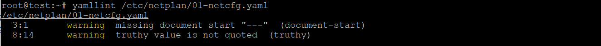

## LINUX服务器系统管理基础

### 动手实战SYSTEMD

- 命令篇
  - 系统管理
  [](https://asciinema.org/a/yA5Tt28JSocYi4aLGy6gIY5Mv) 

  - Unit
    [](https://asciinema.org/a/T6yagMlpMOMnkVXXxKTK7Urgx)

  - 配置文件
    [](https://asciinema.org/a/1QDZ3G5xF5xqoPIxG0pNay0I9)

  - Target
    [](https://asciinema.org/a/SrgOKb0JnZGnP8dsubYvnuUrg)

  - 日志管理
    [](https://asciinema.org/a/5U44IXyDI406joCW2a3RcJWVy)

- 实战篇
  [](https://asciinema.org/a/6KwNQ0ZL0VfcMlT5fXfMPJ2XT)


### 用 tmux 重做上一章的ping前后台执行方式实验
按照下述步骤进行实验：
```bash
# 本实验建议通过SSH远程登录到虚拟机上执行
ping www.baidu.com 2>&1 1>/dev/null &
ping sec.cuc.edu.cn 2>&1 1>/dev/null &

# 注意查看输出结果，观察ping进程的父进程是谁
pstree -A

# 此时退出SSH登录
exit

# 再重新SSH登录到虚拟机上执行
# 注意查看输出结果，观察ping进程的父进程是谁，和退出SSH登录之前相比是否有变化？
pstree -A
```

Before:


After: 


按照上述的打印结果，退出 `ssh` 之前 `ping` 的父进程是 `sshd` 开的 `bash` ；而退出 `ssh` 之后，`ping` 子进程并没有被关闭，而是被 `systemd` 继承。

使用 `tmux` 开启两个窗口，执行下面的指令：

```bash
pstree -A
# 开启一个tmux会话
tmux
# 重复上述实验，用后台进程方式开启新的ping进程
# 再次SSH登录到虚拟机上执行
# 注意查看输出结果，观察ping进程的父进程是谁，和退出SSH登录之前相比是否有变化？
pstree -A
```

Before:


After :


`sshd` 开启的 `tmux` 的父进程直接是 `systemd`，所以退出 `ssh` 后 `tmux` 并没有受到影响。


### 用户标识

```
id --help
id
id -g
id -u
```

- 上述后2个命令的参数作用是什么？

  ```
   -g, --group    print only the effective group ID
   -u, --user     print only the effective user ID
  ```

- 什么是**effective group ID**？

- 什么是**effective user ID**？

  - `effective group ID` 和 `effective user ID` 是相对于 `real user ID` 和 `real group ID` 定义的。`rXid` 表示**进程的真实所有者**，`eXid`表示有效使用的者。


### netplan 又一个「网络配置管理」工具

按照配置示例配置 `host-only` 静态IP:

```yaml
network:
  version: 2
  renderer: networkd
  ethernets:
    enp3s0:
      dhcp4: yes
    enp5s0:
      addresses:
        - 192.168.89.4/24
      match:
        name: eth0
      gateway4: 192.168.89.1
      nameservers:
        addresses: [192.168.89.1, 192.168.89.2]
```

`yamllint` 检查语法：


修改语法后检查：



`netplan apply` 没有提示报错。但是，`ip addr` 发现网络并没有发生变化。后来换用示例脚本，发现 `ip` 还是没有变化（未解决...）


### 本章完成后的自查清单

- 如何添加一个用户并使其具备 `sudo` 执行程序的权限？

  ```bash
  # 添加一个新用户
  adduser username
  
  # 添加到 sudo 用户组
  # -G, --groups GROUPS           new list of supplementary GROUPS
  # -a, --append                  append the user to the supplemental GROUPS
  usermod -aG sudo username
  ```

- 如何将一个用户添加到一个用户组？

  ```bash
  usermod -aG groupname username
  ```

- 如何查看当前系统的分区表和文件系统详细信息？

  ```bash
  # 分区表
  fdisk -l
  # 文件系统信息
  df -a
  ```

- 如何实现开机自动挂载 `Virtualbox` 的共享目录分区？

  ```bash
  # 在 `VirtualBox` 选择需要挂载的文件夹，选择 自动挂载 和 固定分配
  mkdir ~/share
  
  apt install virtualbox-guest-utils
  
  # 修改 /etc/fstab，添加一行
  vi /etc/fstab
  [+] share /root/share vboxsf defaults 0 0
  
  # 重启
  reboot
  ```

- 基于LVM（逻辑分卷管理）的分区如何实现动态扩容和缩减容量？

  ```bash
  # 查看物理卷的剩余大小
  pvdisplay
  
  # 动态增长
  lvextend -L +32M server-vg/swap_1
  
  # 缩减容量
  lvreduce -L -32M server-vg/swap_1
  ```

  截图如下( `Physical Extent` 只剩下 8... (32 M)  ):

  

  


- 如何通过 `systemd` 设置实现在网络连通时运行一个指定脚本，在网络断开时运行另一个脚本？
  ```bash
  # 编辑 networking 的配置文件
  vi /lib/systemd/system/networking.service
  
  [service]
  [+] ExecStartPre=your.path1
  [+] ExecStopPost=your.path2
  ```
  测试使用 `ExecStartPre=/bin/bash /root/i1.sh` 和 `ExecStopPost=/bin/bash /root/i2.sh`:

  

- 如何通过 `systemd` 设置实现一个脚本在任何情况下被杀死之后会立即重新启动？实现**杀不死**？

  ```bash
  # 在配置文件中添加 restart
  [Service]
  [+] Restart=always
  ```
  截图如下：

  

  这种方法设置的进程还是可以正常地 `systemctl stop` 的。


### 参阅

- [LVM](https://wiki.ubuntu.com/Lvm)
- [User identifier](<https://en.wikipedia.org/wiki/User_identifier#Saved_user_ID>)

- [In the shell, what does “ 2>&1 ” mean?](https://stackoverflow.com/questions/818255/in-the-shell-what-does-21-mean#comment32269807_818284)

- [Systemd 入门教程：命令篇](<http://www.ruanyifeng.com/blog/2016/03/systemd-tutorial-commands.html>)
- [Systemd 入门教程：实战篇](<http://www.ruanyifeng.com/blog/2016/03/systemd-tutorial-part-two.html>)