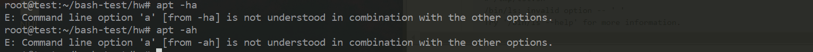

## shell脚本编程练习基础

### 实验要求

- 继承 [第一章：Linux基础（实验）](http://sec.cuc.edu.cn/huangwei/course/LinuxSysAdmin/chap0x01.exp.md.html) 的所有实验报告要求
- 上述任务的所有源代码文件必须单独提交并提供详细的**–help**脚本内置帮助信息
- 任务二的所有统计数据结果要求写入独立实验报告


### 实验环境

- OS  >>>  `ubuntu 18.04 TLS`
- Bash  >>>  `GNU bash, version 4.4.19(1)-release (x86_64-pc-linux-gnu)`


### 具体任务及实验问题

这里按任务的难度递增的顺序介绍（这里把**任务分为 3 个**）：

(1) 任务三：用 `bash` 编写一个文本批处理脚本，对以下附件分别进行批量处理完成相应的数据统计任务： 

- Web服务器访问日志
  - 统计访问来源主机 `TOP 100` 和分别对应出现的总次数
  - 统计访问来源主机 `TOP 100 IP` 和分别对应出现的总次数
  - 统计最频繁被访问的 `URL TOP 100`
  - 统计不同响应状态码的出现次数和对应百分比
  - 分别统计不同4XX状态码对应的 `TOP 10 URL` 和对应出现的总次数
  - 给定URL输出 `TOP 100` 访问来源主机

- 实验问题：

  - 使用 `getopts` 获取参数，但是只支持短参数，不支持长参数。

  - 观察 `linux` 下其他程序的 `-h` 的使用，举几个例子：

    ```bash
    # -h 参数在前
    apt -ha
    
    # -h 参数在后
    apt -ah
    ```

    

    显然，输出结果一致，都是不可用的。

    ```bash
    # # -h 参数在前
    systemctl -ha
    
    # -h 参数在后
    systemctl -ah
    ```

    
    

    同时输出了帮助信息，`-a` 同时失效。实验中的程序使用 `-h` 和其他参数联用时，不仅会打印输出信息，其他的参数也不会失效。该问题将在下一个脚本中改进 ( 将 `-h` 参数进行特殊处理)。

  

 - 测试语句：

    因为使用了 `getopts` ，测试语句比较简单：

    ```bash
    # 打印帮助信息
    bash test3.sh web_log.tsv -h
    
    # 输出全部的统计信息 
    bash test3.sh web_log.tsv -A
    
    # 给定 url 打印访问信息
    bash test3.sh web_log.sh -g "/ksc.html"
    
    # 输出全部的统计信息
    bash test3.sh web_log.tsv -uicrsg
    ```

    

（2）任务二：用 `bash` 编写一个文本批处理脚本，对以下附件分别进行批量处理完成相应的数据统计任务： 

- 2014世界杯运动员数据

  - 统计不同年龄区间范围（20岁以下、[20-30]、30岁以上）的球员**数量**、**百分比**
  - 统计不同场上位置的球员**数量**、**百分比**
  - 名字最长的球员是谁？名字最短的球员是谁？
  - 年龄最大的球员是谁？年龄最小的球员是谁？

- 实验问题：

  - 统计不同场位的球员数量百分比时，同时发现了**英语** `Defender` (后卫) 和 **法语** `Défenseur` (后卫)，因此在 `awk` 统计时进行了特殊处理。

    ```bash
    awk -F '\t' 'NR!=1{if($5 == "Défenseur") print "Defender";else print $5}' $filename
    ```

  - 统计名字最短的球员时，得到的结果：

    

    

    发现最短的名字的长度只有 2，简单地查一下相关资料：

    

    发现统计数据中的名字只是简写，这个人的全名还是很长的。数据并没有问题。
    
    ~如果不去除特殊字符(`0x20` 和 `-` )，最长的名字有 26 个字符，最后处理还是去除了特殊字符。~

  - 在 (1) 中 `-h`  参数的位置问题，还是使用 `getopts`，同时采用了一种和以上两个样例都不相同的改进方法：

    ```bash
    # 测试样例
    bash test2.sh -ha
    
    bash test2.sh -ah
    
    bash test2.sh worldcupplayerinfo.tsv -h
    ```

    

 - 测试语句：

    ```bash
    # 获得帮助信息
    bash test2.sh -h
    
    # 查看全部的统计信息
    bash test2.sh worldcupplayerinfo.tsv -A
    
    # 查看全部的统计信息
    bash test2.sh worldcupplayerinfo.tsv -aoypls
    ```


（3）任务一：用bash编写一个图片批处理脚本，实现以下功能：

- 支持命令行参数方式使用不同功能
- 支持对指定目录下所有支持格式的图片文件进行批处理
- 支持以下常见图片批处理功能的单独使用或组合使用
  - 支持对 `jpeg` 格式图片进行图片质量压缩
  - 支持对 `jpeg/png/svg` 格式图片在保持原始宽高比的前提下压缩分辨率
  - 支持对图片批量添加自定义文本水印
  - 支持批量重命名（统一添加文件名前缀或后缀，不影响原始文件扩展名）
  - 支持将 `png/svg` 图片统一转换为 `jpg` 格式图片
- 实验问题：
  - 使用 `getopt` 改进了 (2) 不支持长参数的问题。
  - 在获取文件后缀时，只是简单地使用 `${f#*.}`  截取后缀。(也可以使用 `identify -format "%m"` ，如果遇到非图片类型的文件，会输出 `stderror`，  通过 `2>&1` 重定向到标准输出，之后根据标准输出判断文件类型，个人感觉这种方法好一些。）

- 测试语句
```bash
  # 打印任务一帮助信息
  bash bash/test1.sh --help
  
  # 将 1.svg 转为 .jpg 并增加后缀 "suf" 
  bash test1.sh -i test/3.svg --suffix "suf" -f
  
  # 将 test/ 目录下的 所有 SVG|PNG|JPG 文件添加水印 "textfortest",
  # 压缩质量 50 % , 比例变为 500 x 400 之后增加前缀 "pre" 
  bash bash/test1.sh -i test/ -p "pre" -w "textfortest" --quality 50 -r 500x400
```

### 参阅
  - [实验报告](https://github.com/CUCCS/linux-2019-jckling/tree/0x04)
  
  - [Shell 脚本编程基础](https://github.com/CUCCS/linux-2019-Jasmine2020/tree/linux4/Lab4_Shell%E7%BC%96%E7%A8%8B)
  
  - [getopt](https://www.mkssoftware.com/docs/man1/getopt.1.asp)
  
  - [Shell Scripting Tutorial - Tip Getopts](https://www.shellscript.sh/tips/getopts/)
  
  - [ShellCheck](https://www.shellcheck.net/)
  
