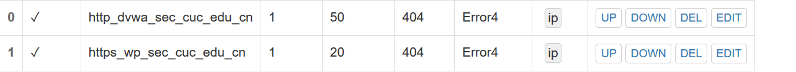

# 第五章：Web服务器

## 实验环境及版本信息

- `Host OS` >>> `Windows 10`
- `VirtualBox OS` >>> `unbuntu 18.04 TLS Server`
- `Nginx` >>> `nginx version: nginx/1.14.0 (Ubuntu)`
- `wordpress` >>> `4.7.0`

## 基本要求

- 安装 `VeryNginx`

  ```bash
  # 安装依赖
  apt install make
  apt install gcc
  apt-get install libpcre3 libpcre3-dev
  apt-get install libssl1.0-dev
  apt install zlib1g-dev
  apt install build-essential
  apt install lua-rex-pcre
  
  # 克隆 VeryNginx 到本地
  git clone https://github.com/alexazhou/VeryNginx.git
  
  # 安装并启动 VeryNginx
  cd VeryNginx
  python install.py install
  /opt/verynginx/openresty/nginx/sbin/nginx
  ```

  

- 安装 `Nginx`

  ```bash
  # 安装 nginx
  apt update
  apt install nginx
  
  # 查看 nginx 版本信息
  nginx -v
  ```

- 安装 `WordPress(LEMP)`

  ```bash
  # Creating a MySQL Database and User for WordPress
  apt-get install mysql-server
  mysql -u root -p
  CREATE DATABASE wordpress DEFAULT CHARACTER SET utf8 COLLATE utf8_unicode_ci;
  GRANT ALL ON wordpress.* TO 'wordpressuser'@'localhost' IDENTIFIED BY 'password';
  FLUSH PRIVILEGES;
  EXIT;
  
  # Installing Additional PHP Extensions
  apt update
  apt install php-curl php-gd php-intl php-mbstring php-soap php-xml php-xmlrpc php-zip
  systemctl restart php7.2-fpm
  
  # Downloading WordPress
  cd /tmp
  curl -LO https://wordpress.org/wordpress-4.7.tar.gz
  tar xzvf wordpress-4.7.tar.gz
  cp /tmp/wordpress/wp-config-sample.php /tmp/wordpress/wp-config.php
  mkdir /var/www/html/wordpress
  cp -a /tmp/wordpress/. /var/www/html/wordpress
  chown -R www-data:www-data /var/www/html/wordpress
  ```

- 配置 `wordpress`

  ```bash
  # 配置 wp-config.php 中数据库相关信息
  vi /var/www/html/wordpress/wp-config.php
  ```

  添加 `wordpress` 配置文件 `/etc/nginx/sites-available/wp.sec.cuc.edu.cn`

  ```bash
  server {
      listen 8888;
  
      root /var/www/html/wordpress;
  
      index index.php index.html index.htm index.nginx-debian.html;
  
      server_name wp.sec.cuc.edu.cn;
  
      location / {
              try_files $uri $uri/ =404;
      }
  
      location ~ \.php$ {
              include snippets/fastcgi-php.conf;
              fastcgi_pass unix:/var/run/php/php7.2-fpm.sock;
      }
  
      location ~ /\.ht{
              deny all;
      }
  }
  ```

  配置完成之后，重新启动 `nginx` 服务：

  ```bash
  # 重启服务
  systemctl restart nginx 
  ```

  这里遇到问题：

  

  发现 `8080` 端口并没有服务。`lsof` 发现 `apache` 占用端口，直接 `kill`:

  

  排错时用到的一条指令：

  ```bash
  # 指定对 default 配置文件进行检测
  nginx -c /etc/nginx/sites-enabled/default -t
  ```

  


- 安装 `dvwa`

  ```bash
  # 建立 DVWA 目录
  mkdir /var/www/html/DVWA
  
  # 克隆到 tmp 目录下
  git clone https://github.com/ethicalhack3r/DVWA /tmp/DVWA
  
  # 拷贝到网站目录
  sudo rsync -avP /tmp/DVWA/ /var/www/html/DVWA
  
  # 复制 config.inc.php.dist 为 config.inc.php
  cp /var/www/html/DVWA/config/config.inc.php.dist /var/www/html/DVWA/config/config.inc.php
  
  # 配置 dvwa 数据库
  mysql -u root -p
  CREATE DATABASE dvwa DEFAULT CHARACTER SET utf8 COLLATE utf8_unicode_ci;
  GRANT ALL ON dvwa.* TO 'dvwauser'@'localhost' IDENTIFIED BY 'password';
  FLUSH PRIVILEGES;
  exit;
  
  # 重启 mysql
  systemctl restart mysql
  ```

  `Grant` 遇到问题：

  

  ```mysql
  # 展示 validate_password...的变量
  SHOW VARIABLES LIKE 'validate_password%';
  
  # 修改展示出来的变量
  SET  GLOBAL validate_password...=xxx;
  ```

- 配置 `dvwa`

  ```bash
  # 修改 config.inc.php
  vim /var/www/html/DVWA/config/config.inc.php
  
  # 修改相应的项
  $_DVWA = array();
  $_DVWA[ 'db_server' ]   = '127.0.0.1';
  $_DVWA[ 'db_database' ] = 'dvwa';
  $_DVWA[ 'db_user' ]     = 'root';
  $_DVWA[ 'db_password' ] = 'password';
  
  # 修改 php.ini
  allow_url_include = On
  display_errors = Off
  systemctl restart php7.2-fpm
  
  # 增添 dvwa 的 ngixn 配置文件
  vi /etc/nginx/sites-avaliable/dvwa
  ```

  配置文件如下：

  ```bash
  server {
      listen 8889;
      listen [::]:8889;
  
      root /var/www/html/DVWA;
  
      index index.php index.html index.htm index.nginx-debian.html;
  
      server_name dvwa.sec.cuc.edu.cn;
  
      location / {
              try_files $uri $uri/ =404;
      }
  
      location ~ \.php$ {
              include snippets/fastcgi-php.conf;
              fastcgi_pass unix:/var/run/php/php7.2-fpm.sock;
      }
  
      location ~ /\.ht{
              deny all;
      }
  }
  ```

  ```bash
  # 软链到 sites-enabled
  sudo ln -s /etc/nginx/sites-available/dvwa.sec.cuc.edu.cn /etc/nginx/sites-enabled/
  
  # 重启 nginx
  systemctl restart nginx
  ```

  遇到问题：`setup.php` 显示数据库连接失败

  之前配置 `config.inc.php` 时，`db_user` 设置为 `root`，而在 `Grant` 时，授权用户名为 `dvwauser`，两者不一致导致数据库连接出错。修改其一即可正常连接：

  

- 实验拓扑图

  

- 更改宿主机 `Hosts` 文件，添加记录

  ```
  192.168.89.3 wp.sec.cuc.edu.cn	
  192.168.89.3 dvwa.sec.cuc.edu.cn
  ```

  遇到问题：

  

  解决方案：右键 `属性` => `安全` => `高级` => `更改权限` => `添加` => `选择主体` => `高级` => `立即查找` => 选择本机的用户 => `完全控制` => `确定`，即可修改文件。 配置完成后访问结果：

  

- 配置 `wordpress` 的 `ssl` 证书

  ```bash
  openssl req -x509 -nodes -days 365 -newkey rsa:2048 -keyout /etc/ssl/private/nginx-selfsigned.key -out /etc/ssl/certs/nginx-selfsigned.crt
  
  # vi /etc/nginx/snippets/self-signed.conf
  ssl_certificate /etc/ssl/certs/nginx-selfsigned.crt;
  ssl_certificate_key /etc/ssl/private/nginx-selfsigned.key;
  ```

  

- 配置 `VeryNginx` 的反向代理

  ```bash
  # 增加 verynginx 对 443 端口的监听
  vi /opt/verynginx/openresty/nginx/conf/nginx.conf
  
  ...
  
  # 开启 VeryNginx
  /opt/verynginx/openresty/nginx/sbin/nginx -s reload
  ```

  配置如下：

  ```
  server{
          listen 443;
          #this line shoud be include in every server block
          include /etc/nginx/snippets/self-signed.conf;
          include /opt/verynginx/verynginx/nginx_conf/in_server_block.conf;
  		
  		
          location = / {
              root   html;
              index  index.html index.htm;
          }
  }
  ```

  配置 `verynginx` 的 `matcher`:

  

  配置 `verynginx` 的 `up Stream` 和 `Proxy Pass`:

  

  

  参考 [实验5 web 服务器的搭建](<https://github.com/CUCCS/linux-2019-jackcily/blob/job5/job5/%E5%AE%9E%E9%AA%8C5.md>)，修改数据库内容：
  ```mysql
  mysql -u root -p
  use wordpress;
  
  # 找到 wp-option 中的数据进行修改
  update wp_options set option_value = 'https://wp.sec.cuc.edu.cn' where option_name = 'siteurl' or option_name = 'home';
  ```

  

  ## 安全加固要求

- 使用IP地址方式均无法访问上述任意站点，并向访客展示自定义的**友好错误提示信息页面-1**

  - 增加 `matcher`、`response`、`filter`

    

    

    

    

  - 实验结果

    

- `Damn Vulnerable Web Application (DVWA) ` 只允许白名单上的访客来源IP，其他来源的IP访问均向访客展示自定义的**友好错误提示信息页面-2**

  - 增加 `matcher`、`response`、`filter`

    

    

    

  - 实验结果

    

- 在不升级 `Wordpress` 版本的情况下，通过定制 `VeryNginx` 的访问控制策略规则，**热**修复 `WordPress < 4.7.1 - Username Enumeration`

  - 增加 `matcher`、`response`、`filter`

    

    

    

  - 实验结果

    

- 通过配置 `VeryNginx` 的Filter规则实现对 `Damn Vulnerable Web Application (DVWA)` 的SQL注入实验在低安全等级条件下进行防护

  - 增加 `matcher`、`response`、`filter`

    

    

    

  - 实验结果

    

## VeryNginx配置要求

- `VeryNginx` 的 `Web` 管理页面仅允许白名单上的访客来源IP，其他来源的IP访问均向访客展示自定义的友好错误提示信息页面-3

  - 增加 `matcher`、`response`、`filter`

    

    

    

  - 实验结果

    

- 通过定制 `VeryNginx` 的访问控制策略规则实现：

  - 限制 `DVWA` 站点的单IP访问速率为每秒请求数 `< 50`

  - 限制 `Wordpress` 站点的单IP访问速率为每秒请求数 `< 20`

  - 超过访问频率限制的请求直接返回自定义**错误提示信息页面-4**

    - 增加 `Frequency Limit `、`response`	

      

      

    - 使用 `PyFlooder` 攻击

      

- 禁止curl访问

  - 增加 `matcher`、`filter`

    

    

  - 实验结果

    

最后的配置文件：

- [/opt/verynginx/openresty/nginx/conf/nginx.conf](config\ngixn.conf)

-  [/etc/nginx/sites-enabled/dvwa.sec.cuc.edu.cn](config\dvwa.sec.cuc.edu.cn) 
-  [/etc/nginx/sites-enabled/wp.sec.cuc.edu.cn](config\wp.sec.cuc.edu.cn) 

## 参阅

- [VeryNginx](https://github.com/alexazhou/VeryNginx/blob/master/readme_zh.md)
- [VeryNginx Wiki](https://github.com/alexazhou/VeryNginx/wiki/%E7%9B%AE%E5%BD%95)
- [Example nginx configuration](<https://nginx.org/en/docs/example.html>)
- [How nginx processes a request](<https://nginx.org/en/docs/http/request_processing.html>)
- [How To Install Nginx on Ubuntu 18.04](<https://www.digitalocean.com/community/tutorials/how-to-install-nginx-on-ubuntu-18-04#step-1-%E2%80%93-installing-nginx>)
- [How To Install WordPress with LEMP on Ubuntu 18.04](<https://www.digitalocean.com/community/tutorials/how-to-install-wordpress-with-lemp-on-ubuntu-18-04>)
- [“configuration file /etc/nginx/nginx.conf test failed”: How do I know why this happened?](<https://stackoverflow.com/questions/22306006/configuration-file-etc-nginx-nginx-conf-test-failed-how-do-i-know-why-this-h>)
- [How to Install and Configure DVWA Lab on Ubuntu 18.04 server](<https://kifarunix.com/how-to-setup-damn-vulnerable-web-app-lab-on-ubuntu-18-04-server/>)
- [Your password does not satisfy the current policy requirements](<https://stackoverflow.com/questions/43094726/your-password-does-not-satisfy-the-current-policy-requirements>)
- [Configuring HTTPS servers](<https://nginx.org/en/docs/http/configuring_https_servers.html>)
- [WordPress < 4.7.1 - Username Enumeration](<https://www.exploit-db.com/exploits/41497>)
- [WordPress REST API 内容注入漏洞](<https://www.seebug.org/vuldb/ssvid-92637>)
- [实验5 web 服务器的搭建](<https://github.com/CUCCS/linux-2019-jackcily/blob/job5/job5/%E5%AE%9E%E9%AA%8C5.md>)
- [高级Web服务器配置](<https://github.com/CUCCS/linux-2019-jckling/blob/0x05/0x05/%E5%AE%9E%E9%AA%8C%E6%8A%A5%E5%91%8A.md>)